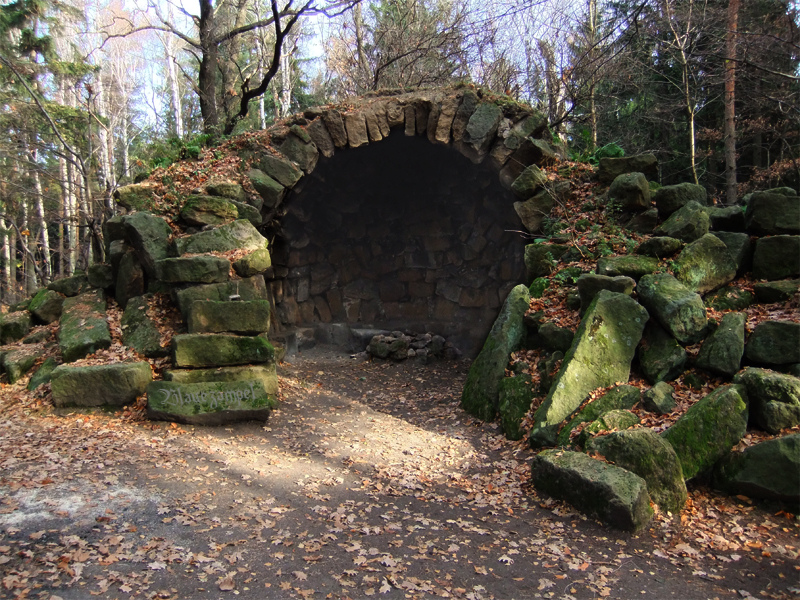

+++
title = '32. Berggiesshübler Wandertag'
date = 2022-04-10T18:19:24+02:00
draft = false
+++

Der Gebirgsverein 1899 Berggießhübel e.V. lädt alle Einwohner und Gäste unserer Stadt recht herzlich zum 32. Berggießhübler Wandertag **am Sonntag, den 08. Mai 2022,** ein.
Wir würden uns freuen, Sie nach 2 Jahren pandemiebedingter Pause wieder begrüßen zu dürfen.

<!--more-->

Angeboten werden 3 Routen von ca. 6,5 km, 12 km und 16,5 km.
Die Routen sind mit einer Spezialmarkierung versehen.
Start und Ziel ist wie immer am Besucherbergwerk „Marie-Louise-Stolln“, Startzeit von 8.00 Uhr bis 10.00 Uhr.
Das Startgeld beträgt 3,00 Euro pro Person, für Kinder ist die Teilnahme frei.

Der Wandertag steht in diesem Jahr unter dem Motto „Unterwegs im mittleren Gottleubatal“.  

Genießen Sie links und rechts der Gottleuba ausgedehnte Wälder, schöne Aussichten und eindrucksvolle Felsgebilde.
Entdecken Sie Spuren vergangener Zeiten und lassen Sie die Umgebung auf sich wirken. 

Bereits der „Berggießhübler Wanderführer“, 1938 herausgegeben vom damaligen Bürgermeister Rudolf Landgraf, spricht von der Heilsamkeit der Landschaft und des Wanderns.
Lassen Sie also Hektik und Alltagsstress hinter sich und spüren Sie mit allen Sinnen die wohltuende Wirkung eines Streifzuges durch die Natur. 

Das Begleitheft soll Ihnen wie immer weiterführende Informationen liefern.
Außerdem erhält jeder Teilnehmer eine Urkunde.

Nach Ihrer Wanderung können Sie sich mit einem Imbiss am Besucherbergwerk stärken.
Der Gebirgsverein bedankt sich an dieser Stelle beim Team der Kurgesellschaft für die Unterstützung.

Wir wünschen Ihnen bereits jetzt angenehme Stunden und schöne Erlebnisse bei Ihrer Wanderung und freuen uns auf Ihren Besuch.

Mit freundlichen Grüßen und einem herzlichen „Glück auf“  
Der Gebirgsverein Berggießhübel
