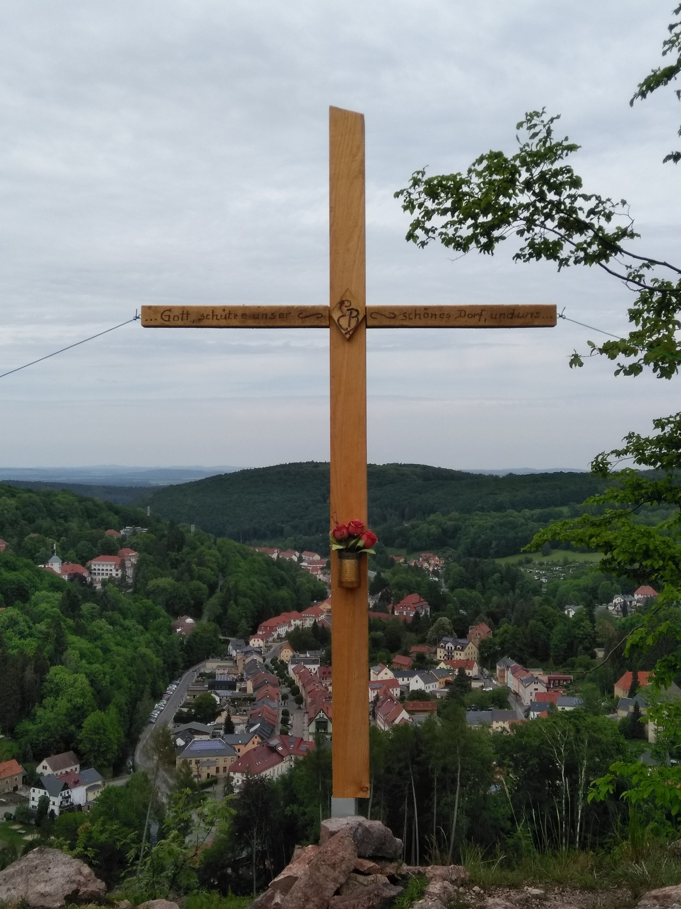

+++
title = '33. Berggiesshübler Wandertag'
date = 2023-04-27T00:13:35+02:00
draft = false
+++

Der Gebirgsverein 1899 Berggießhübel e.V. lädt alle Einwohner und Gäste der Stadt recht herzlich zum 33. Berggießhübler Wandertag **am Sonntag, den 14. Mai 2023,** ein.

<!--more-->

Angeboten werden 3 Routen von ca. 6 km, 10 km und 15 km Länge.
Die Routen sind mit einer Spezialmarkierung versehen.
Start und Ziel ist wie immer am Besucherbergwerk „Marie-Louise-Stolln“, Startzeit von 8.00 Uhr bis 10.00 Uhr. 

Das Startgeld beträgt 3,00 Euro pro Person, für Kinder ist es frei.

Der Wandertag steht in diesem Jahr unter dem Motto „Entdeckungen auf dem Gottleubataler Panoramaweg“.
 

Genießen Sie romantische Wege, ruhige Wälder und schöne Aussichten.
Entdecken Sie Spuren vergangener Zeiten und lassen Sie die Umgebung auf sich wirken. 

Bereits der „Berggießhübler Wanderführer“, 1938 herausgegeben vom damaligen Bürgermeister Rudolf Landgraf, spricht von der Heilsamkeit der Landschaft und des Wanderns.
Lassen Sie also Hektik und Alltagsstress hinter sich und spüren Sie mit allen Sinnen die wohltuende Wirkung eines Streifzuges durch die Natur. 

Wie immer bieten wir ein Begleitheft an, das Ihnen weiterführende Informationen zu besonderen Wegpunkten liefern soll.
Außerdem erhält jeder Teilnehmer eine Urkunde.

Nach Ihrer Wanderung können Sie sich mit einem Imbiss am Besucherbergwerk stärken.
Der Gebirgsverein bedankt sich an dieser Stelle schon einmal beim Team der Kurgesellschaft für die Unterstützung.

Wir wünschen Ihnen bereits jetzt angenehme Stunden und schöne Erlebnisse bei Ihrer Wanderung und freuen uns auf Ihren Besuch.

Mit freundlichen Grüßen und einem herzlichen „Glück auf“  
Der Gebirgsverein Berggießhübel
