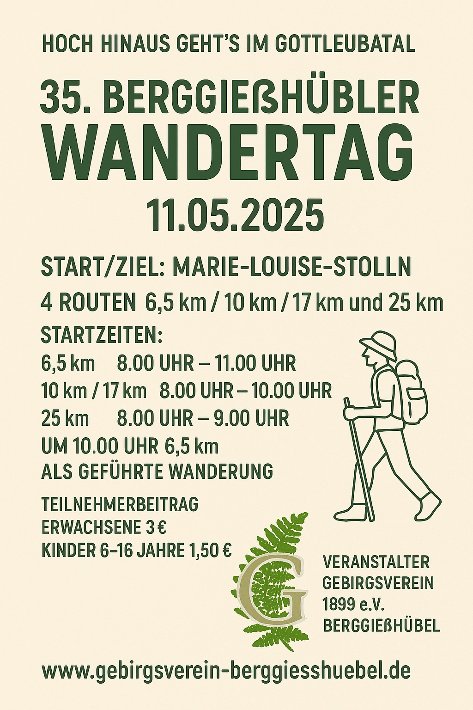

+++
title = '35. Berggiesshübler Wandertag'
date = 2025-04-13T20:56:35+02:00
draft = false
+++

Der Gebirgsverein 1899 Berggießhübel e.V. lädt alle Einwohner und Gäste der Stadt recht herzlich zum 35. Berggießhübler Wandertag **am Sonntag, den 11. Mai 2024,** ein.

<!--more-->

Angeboten werden 4 Routen von ca. 6,5 km, 10 km, 17 km und 25 km Länge.
Die Routen sind mit einer Spezialmarkierung versehen.
Start und Ziel ist wie immer am Besucherbergwerk „Marie-Louise-Stolln“, Startzeit von 8.00 Uhr bis 10.00 Uhr. 

Das Startgeld beträgt 3,00 Euro pro Person, für Kinder ist es frei.

Beim diesjährigen Wandertag haben Sie die Möglichkeit, verschiedene Aussichten auf das Gottleubatal und die umliegenden Regionn zu genießen.
Ob Hochstein, Augustusberg oder Oelsener Höhe: Sie haben die Wahl!
 
Wie immer bieten wir ein Begleitheft an, das Ihnen weiterführende Informationen zu besonderen Wegpunkten liefern soll.
Außerdem erhält jeder Teilnehmer eine Urkunde.

Nach Ihrer Wanderung können Sie sich mit einem Imbiss am Besucherbergwerk stärken.
Der Gebirgsverein bedankt sich an dieser Stelle schon einmal beim Team der Kurgesellschaft für die Unterstützung.

Wir wünschen Ihnen bereits jetzt angenehme Stunden und schöne Erlebnisse bei Ihrer Wanderung und freuen uns auf Ihren Besuch.

Mit freundlichen Grüßen und einem herzlichen „Glück auf“  
Der Gebirgsverein Berggießhübel
