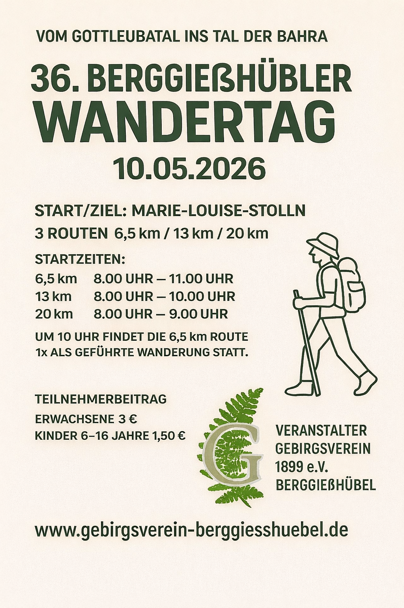

+++
title = '36. Berggiesshübler Wandertag'
date = 2026-04-23T18:53:35+02:00
draft = false
+++

Der Gebirgsverein 1899 Berggießhübel e.V. lädt alle Einwohner und Gäste der Stadt recht herzlich zum 36. Berggießhübler Wandertag **am Sonntag, dem 10. Mai 2026** ein.

<!--more-->

Angeboten werden 3 Routen von ca. 6,5 km, 13 km und 20 km Länge.
Die Routen sind mit einer Spezialmarkierung versehen.
Start und Ziel ist wie immer am Besucherbergwerk „Marie-Louise-Stolln“.
Der früheste Start ist um 8.00 Uhr und der späteste Start ist je nach Route (klein/mittel/groß) um 11.00, 10.00 bzw. 9.00 Uhr möglich.

Die kleine Route wird um 10 Uhr auch als geführte Wanderung angeboten.

Das Startgeld beträgt 3,00 Euro pro Person, für Kinder 1,50 Euro.

Der diesjährige Wandertag führt uns aus dem Gottleubatal hinüber ins Tal der Bahra – wenn Sie möchten, bis zum Zeisigstein!
 
Wie immer bieten wir ein Begleitheft an, das Ihnen weiterführende Informationen zu besonderen Wegpunkten liefern soll.
Außerdem erhält jeder Teilnehmer eine Urkunde.

Nach Ihrer Wanderung können Sie sich mit einem Imbiss am Besucherbergwerk stärken.
Der Gebirgsverein bedankt sich an dieser Stelle schon einmal beim Team der Kurgesellschaft für die Unterstützung.

Wir wünschen Ihnen bereits jetzt angenehme Stunden und schöne Erlebnisse bei Ihrer Wanderung und freuen uns auf Ihren Besuch.

Mit freundlichen Grüßen und einem herzlichen „Glück auf“  
Der Gebirgsverein Berggießhübel
