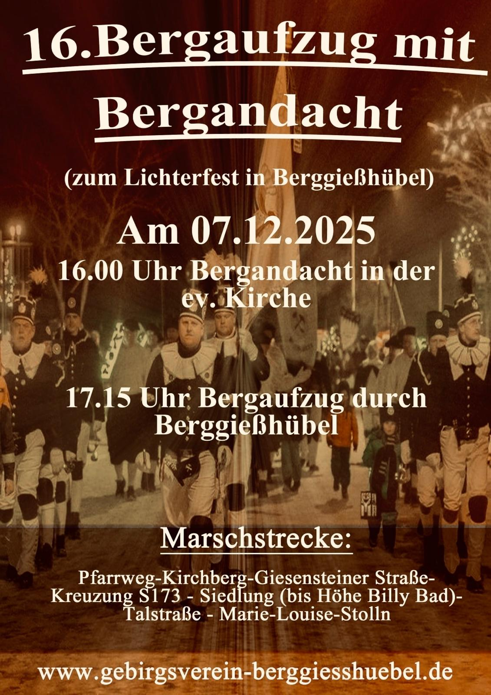

+++
title = 'Lichterfest 2025'
date = 2025-10-31T19:34:42+01:00
+++

Die Bergknappschaft Berggießhübel lädt Sie herzlich zum Berggießhübler Lichterfest **am 07.12.2025** ein.

Um 16:00 Uhr findet die Bergandacht in der evangelischen Kirche statt.
Anschließend startet um 17:15 Uhr der Bergaufzug durch unsere Stadt.

<!--more-->

Darüber hinaus können Sie unsere Bergknappschaft bei den traditionellen vorweihnachtlichen Bergaufzügen im Erzgebirge antreffen, so z.B. bei der großen Abschlussparade am 4. Advent in Annaberg-Buchholz.
