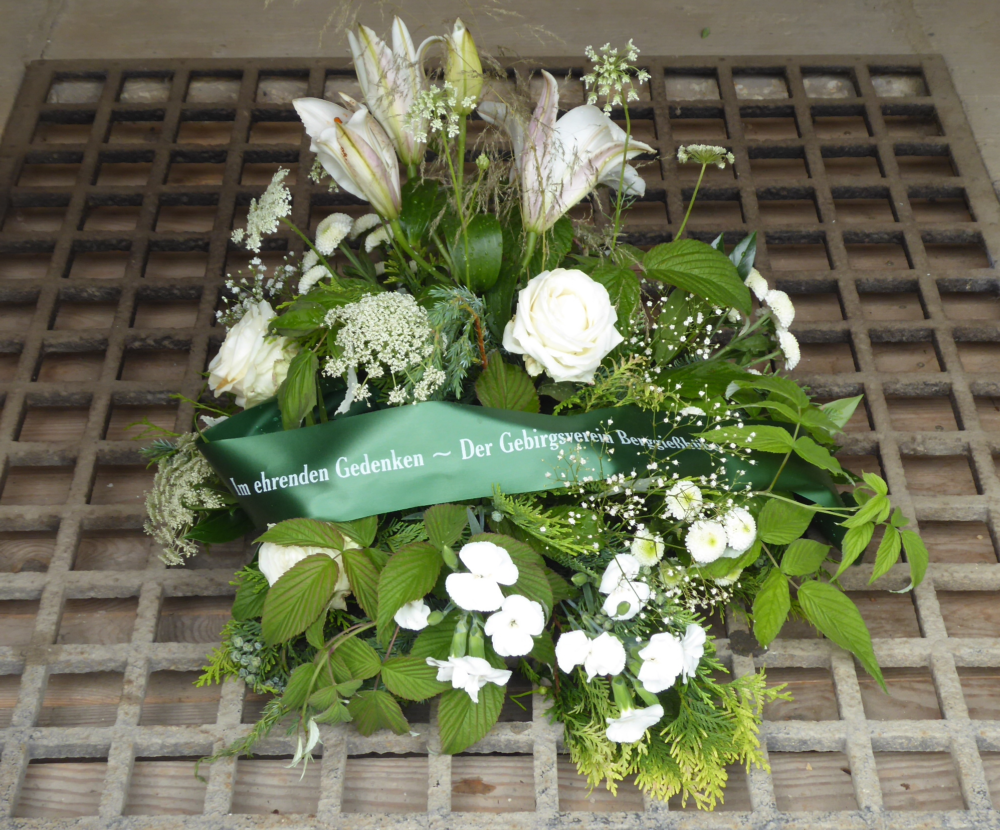
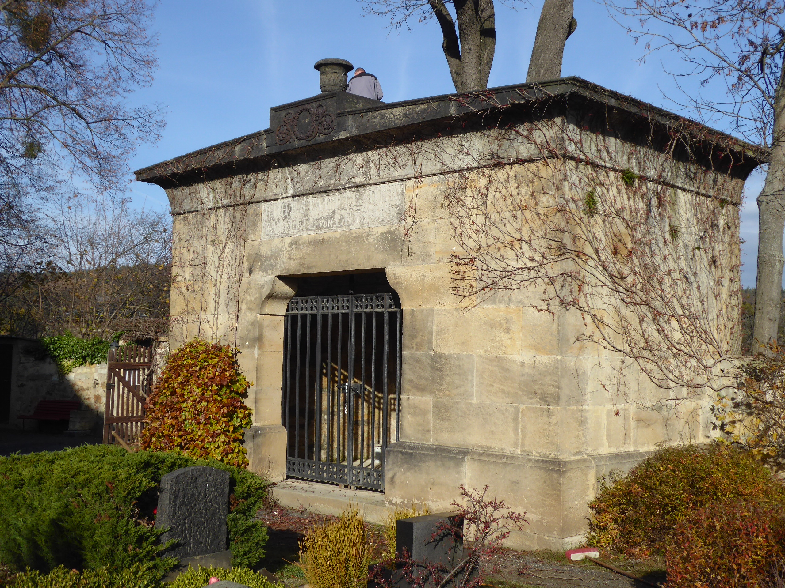

+++
title = 'Sanierung Leyßergruft'
date = 2021-09-19T17:33:29+02:00
draft = false
+++

Im Juli diesen Jahres jährte sich der Geburtstag Leyßers zum 250. Male.
Noch heute stößt man in und um Berggießhübel überall auf die Spuren dieses außergewöhnlichen Menschen.
Aber nicht nur für unsere Stadt, sondern auch für die sächsische Politik hat er, unter anderem als erster Präsident der Zweiten Kammer des sächsischen Landtags, Bedeutendes geleistet.

<!--more-->

Seine letzte Ruhestätte fand er in der Familiengruft auf dem Berggießhübler Friedhof.
Zwei große gusseiserne Tafeln in der inneren Grabanlage würdigen die Verdienste Leyßers und seiner Ehefrau für das Gemeinwohl.
Mitglieder des Gebirgsvereins 1899 Berggießhübel e.V. haben in den letzten Jahrzehnten immer wieder Pflegemaßnahmen an der Gruft durchgeführt.
Dennoch sind in der Vergangenheit insbesondere im Dachbereich Schäden aufgetreten, die dazu führen, dass Feuchtigkeit eindringt.
Desweiteren leidet das Sandsteinmauerwerk insgesamt durch aufsteigende Bodenfeuchtigkeit.
Der Gebirgsverein hat somit nach Möglichkeiten für eine Finanzierung der Sanierung der Gruft gesucht.
Das Ziel ist hierbei, die Sanierung so weit voranzubringen, dass das Andenken an diese bedeutende Person aus der sächsischen Geschichte für zukünftige Generationen gewahrt bleibt.

Nach einer Anfrage hat sich der jetzige sächsische Landtagspräsident Dr. Rößler, in gewisser Weise der jüngste Nachfolger im Amt Leyßers, bereit erklärt, das Vorhaben mit einer Spende in nicht unerheblicher Höhe zu untersützen.
Die ortsansässige Steinmetzfirma Kajer hat sich spontan zu einer Spende in gleicher Höhe entschlossen.
Somit konnten erste Maßnahmen zur Sicherung des Baukörpers verwirklicht werden.
Welche weiteren Schritte noch unternommen werden können, ist vor allem eine finanzielle Frage.
