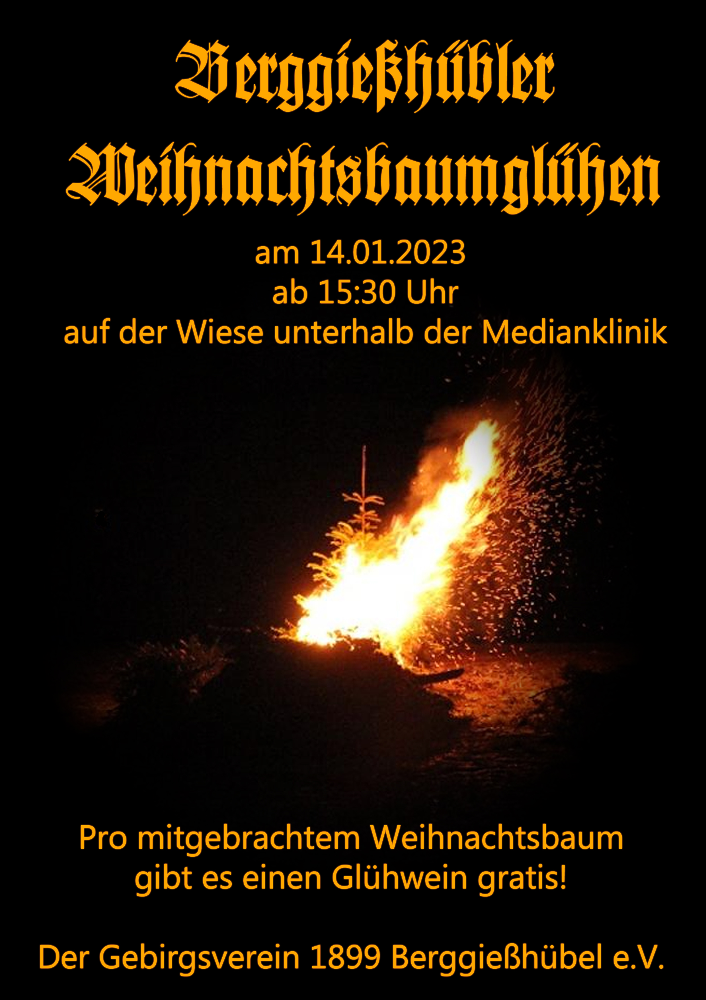

+++
title = 'Weihnachtsbaumglühen 2023'
date = 2023-01-05T21:35:26+01:00
draft = false
+++

Liebe Einwohner und Gäste unserer Stadt, die Mitglieder des Gebirgsvereins 1899 Berggießhübel e.V. wünschen Ihnen ein friedliches, gesundes und erfolgreiches Jahr 2023.
Gleich zu Beginn dieses Jahres möchten wir Sie herzlich zum Berggießhübler Weihnachtsbaumglühen einladen.

<!--more-->

Das Weihnachtsbaumglühen findet am **14. Januar 2023** ab **15.30** Uhr auf der **Wiese unterhalb der Medianklinik** statt.
Dabei wollen wir wieder die ausgedienten Weihnachtsbäume in stimmiger Atmosphäre den Flammen übergeben.
Für das leibliche Wohl sorgt der Gebirgsverein.
Pro mitgebrachtem Weihnachtsbaum gibt es einen Glühwein gratis.
