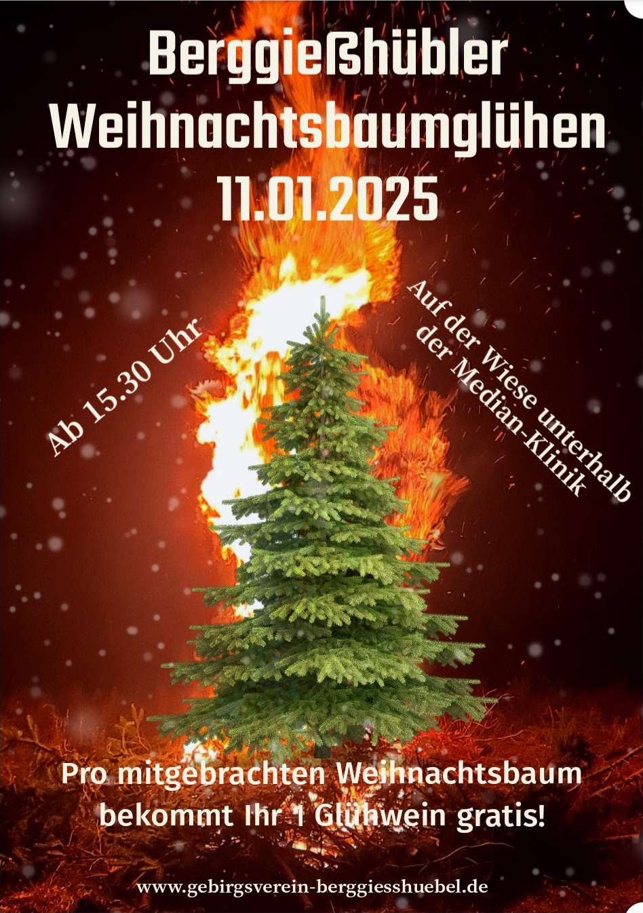

+++
title = 'Weihnachtsgruß'
date = 2024-12-24T14:15:24+01:00
draft = false
+++

Liebe Einwohner und Gäste unserer Stadt,

die Mitglieder des Gebirgsvereins 1899 Berggießhübel e.V. wünschen Ihnen ein besinnliches Weihnachtsfest, erholsame Feiertage und ein gesundes und friedliches Jahr 2025.

Bereits jetzt möchten wir Sie auf unsere erste Veranstaltung im neuen Jahr aufmerksam machen.

<!--more-->

Das Weihnachtsbaumglühen findet am **11. Januar 2024** ab **15.30** Uhr auf der **Wiese unterhalb der Medianklinik** statt.
Dabei wollen wir wieder die ausgedienten Weihnachtsbäume in stimmiger Atmosphäre den Flammen übergeben.
Wenn Sie Ihres Weihnachtsbaums überdrüssig werden, bewahren Sie ihn also noch dis dahin auf, denn pro mitgebrachtem Weihnachtsbaum gibt es einen Glühwein gratis.
Für das leibliche Wohl sorgt der Gebirgsverein.

Mit freundlichen Grüßen und einem herzlichen Glück Auf!  
Der Gebirgsverein
